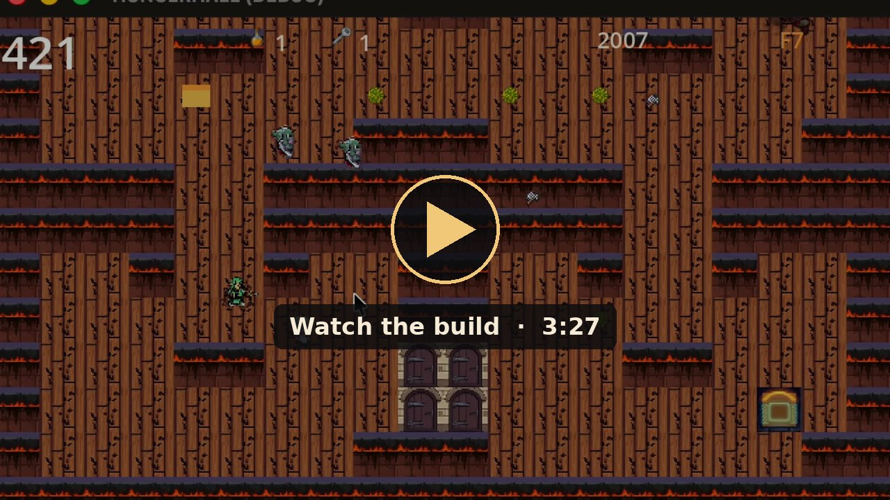
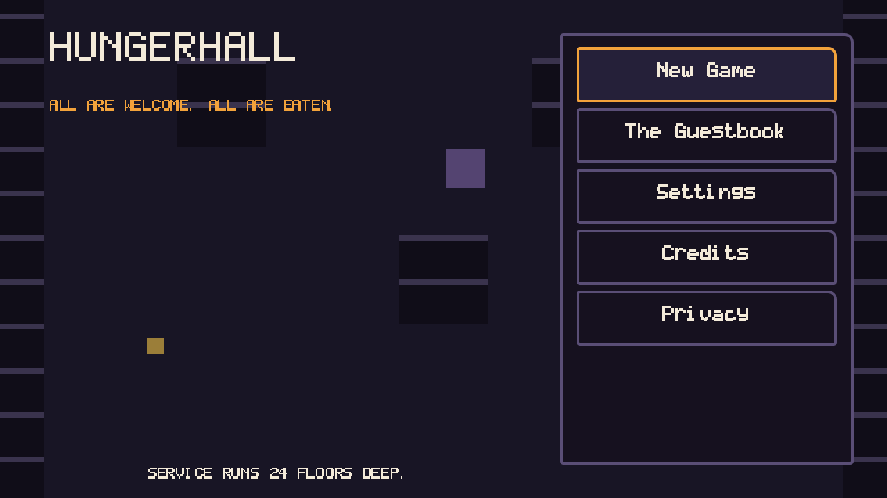
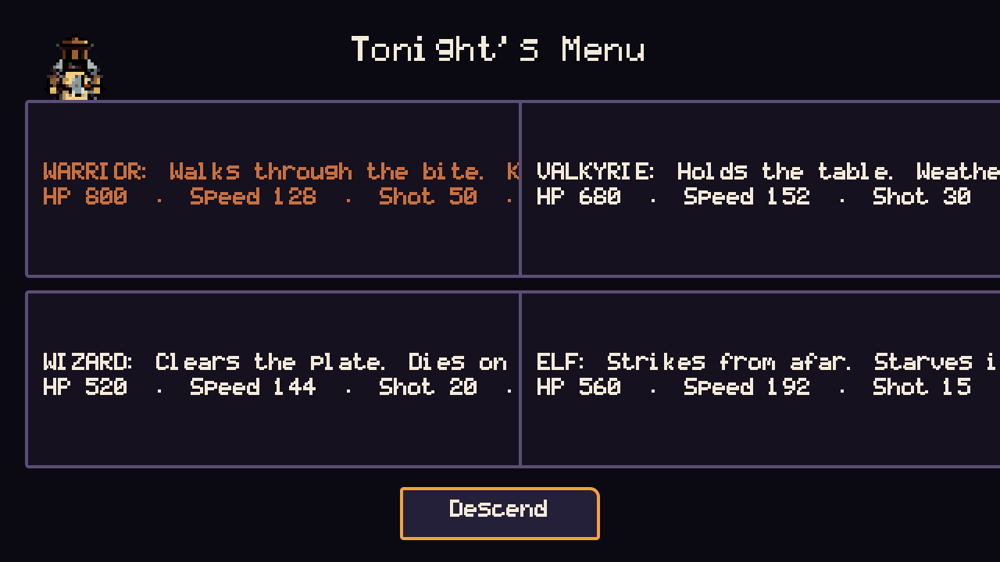
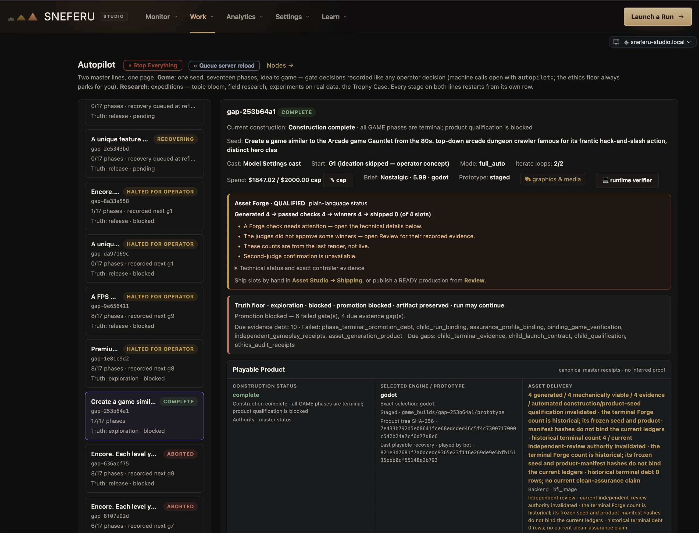
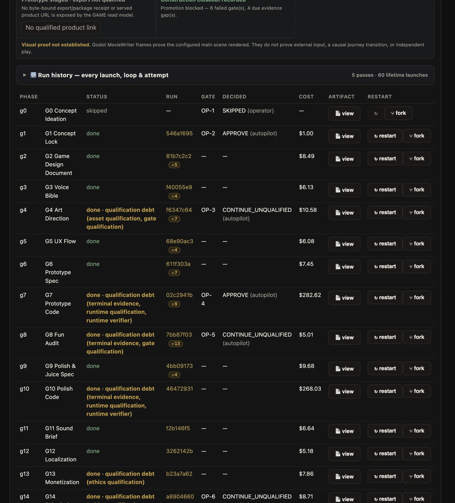
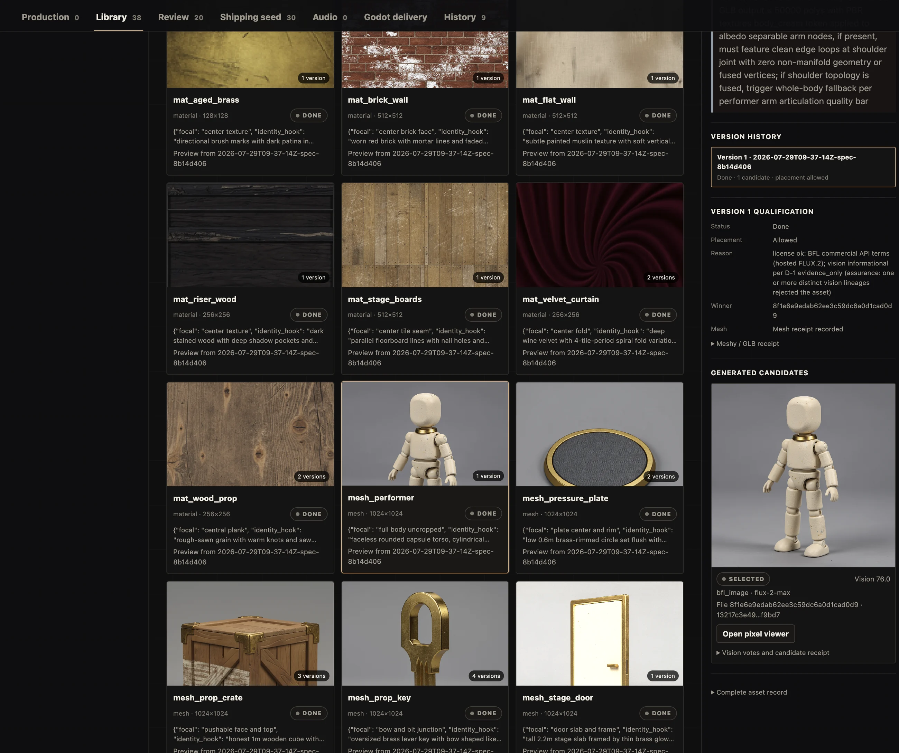

<div align="center">


**One building. One diet. Twenty-four floors.**

*All are welcome. All are eaten.*

A single-player, top-down 2D arcade dungeon crawl in which your health bar is the only clock. It counts down the whole time, food is finite, and every room makes you choose what to spend it on.

Using Sneferu's Game Studio, this game was the result of a single prompt **"Build me a game like the 80s arcade game Gauntlet"**. This one suprised me, first run, zero crashes. Im sure there are bugs in there somewhere. :)


</div>

---

## Watch it play

<div align="center">
<a href="https://sneferu.ai/assets/shots/game-demo.mp4"></a>
<br><sub>Click to play the 3:27 recording of the finished build: class select, the dungeon floors, a game over, and at the end the design document the pipeline wrote for itself. It's also on <a href="https://sneferu.ai/#film">sneferu.ai</a>.</sub>
</div>

## The game

HP moves in one direction: **down**. Time is the opponent, and enemies are how the dungeon raises the price of time. Every room offers three priced routes:

- **The direct lane**: the cheapest in HP, the poorest in score.
- **The greedy loop**: food and treasure behind guards.
- **The suppression push**: advance into the spawn lanes and kill the generator so the reinforcements stop.

Four classes, each a complete survival strategy rather than a stat tweak:

| Class | HP | Speed | Weapon | Special |
|---|:-:|:-:|---|---|
| **Warrior** | 800 | 128 | Axe that pierces; walks through crowds | *Whirlwind*: 4-tile radial, 150 damage |
| **Valkyrie** | 680 | 152 | Spear; takes less damage while advancing into fire | *Aegis*: 3 s of projectile immunity |
| **Wizard** | 520 | 144 | Bolt with 1-tile splash; deletes packs | *Nova*: 5-tile radial, 250 damage |
| **Elf** | 560 | 192 | Arrow, 10-tile range; outranges threats | *Volley*: 12 arrows at 360° |

Twenty-four floors across four zones: **the Drowned Vaults, Cindercrypt, the Starved Deep and the Hollow Throne**. Generators get tougher and spawn faster as you descend, and Death itself starts hunting from floor 13. Layouts are frozen and deterministic, food never respawns, and there's an arcade score with a death penalty and a limited continue system. **Audio ships empty by design.** Every game event already fires through a cue bus that's wired for a 1980s-style announcer and the soundtrack, and the musician delivers the sound after the playable build.

<div align="center">

&nbsp;

<br><sub>Real frames rendered from this repository by Godot 4.7's MovieWriter.</sub>
</div>

## Play it

The engine is Godot 4.7 with the GL Compatibility renderer. It's vanilla, with no addons.

```bash
godot --headless --import --quit                  # first run: build the import cache
godot --path .                                    # play
godot --headless --script tests/test_runner.gd    # PASS: 214  FAIL: 0
```

Controls: **WASD** or arrow keys to move · **J / Z** to throw · **K / X** for a potion · **Esc** to pause · **Enter / Space** to confirm.

The game also plays itself. `godot --headless --path . -- --telemetry-out out.json --games 20 --seed 1` runs the built-in machine player through the real main scene and writes per-floor telemetry.

## What's in the box

| Path | What |
|---|---|
| `main.tscn`, `main.gd`, `core/`, `world/`, `ui/`, `app/`, `juice/` | the game: pure rules modules (combat, enemies, floors, continues), world, screens, and the juice director (hit-stop, shake, particles, cues) |
| `Assets/`, `Fonts/`, `data/`, `Tunables.json` | pixel art (4 heroes, 6 enemies, 4 zone tilesets), fonts, frozen floor data, and the balance knobs |
| `tests/` · `ci/` · `tools/` | the 214-test suite, the machine player, a floor baker and solver, and the attract-reel capture |
| `design/` | the full design bundle: concept lock, game design document, voice bible, art bible, UX flow, sound brief, juice spec, fun audit, monetization ($5.99 target), localization plan, store kit and launch kit |

## Status, honestly

The pipeline ran phases G1–G15 (G0 was skipped by the operator, and G16 live-ops produced no product). By its own closeout, the build is **exploratory, not release-qualified**: six evidence gates failed, including independent gameplay receipts and proof of asset generation. `IMPLEMENTATION_NOTES.md` and `PROTOTYPE_BRIEF.md` §12 list the known blockers. One visible one: on the class-select screen, class descriptions overflow their cards.

## How it was made

HUNGERHALL is the showcase run of **Sneferu's Game Pipeline** (master `gap-253b64a1`). The seed asked for a single-player take on the 1985 arcade dungeon crawler, in 2D, awesome and usable. It went through concept lock, the design document, voice and art bibles, the UX flow and the prototype spec, then a cooperative build in Godot (G7). A fun audit followed, then a polish-and-juice pass (G10), sound, localization, monetization, a Steam store kit and a launch kit. Each phase was argued out between independent models and gated by reviewers. Total model spend: $1,847.

**Runtime link to Sneferu:** none. Sneferu's Game Pipeline built HUNGERHALL, and the game runs on its own in Godot.

## Built by Sneferu

HUNGERHALL came out of **[Sneferu Studio](https://sneferu.ai)** from a one-line request. These are the Studio screens that make games like it.

<div align="center">

<br><sub>The production in Sneferu Studio's Autopilot. It completed 17 of 17 phases for $1,847.02 of a $2,000 cap, and the gates it failed are listed on the page rather than hidden.</sub>
</div>

<div align="center">

<br><sub>The same production, phase by phase: each stage's status, gate decision and cost, with a restart button on every row.</sub>
</div>

<div align="center">

<br><sub>The Asset Studio, where a game's artwork is generated and approved. Every texture and 3D model keeps its earlier versions, the reasoning that it is legal to use, and the votes that let it into the game.</sub>
</div>

<p align="center"><b><a href="https://sneferu.ai">See the whole studio at sneferu.ai →</a></b></p>

<div align="center">

---


<sub>README by Claude (Anthropic).</sub>

</div>
